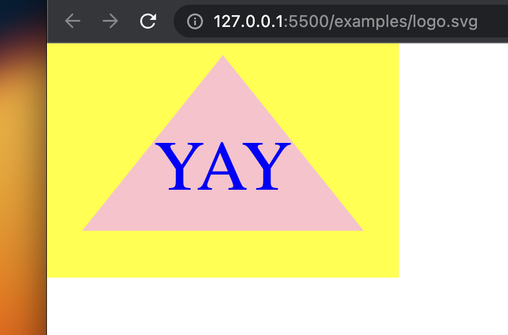

# SVG-Logo-Maker

## Description

ABOUT THIS APPLICATION:
I wanted to create an easy-to-use program that accepts user input to generate a logo. This program will automatically generate an SVG file that contains a user identified shape, text with three characters, and colors for the shape, text, and background color. The user enters their desired colors and shapes by answering the prompts generated by npm inquirer. This application will simplify the logo generation process. 
Building this application taught me how to create tests for my code using Jest. Additionally, I learned more about Object-oriented programming and how it can contribute to the DRY programming paradigm. Classes are useful when working with many kinds of data. 

USER STORY: 
AS a freelance web developer
I WANT to generate a simple logo for my projects
SO THAT I don't have to pay a graphic designer

ACCEPTANCE CRITERIA: 
GIVEN a command-line application that accepts user input
WHEN I am prompted for text
THEN I can enter up to three characters
WHEN I am prompted for the text color
THEN I can enter a color keyword (OR a hexadecimal number)
WHEN I am prompted for a shape
THEN I am presented with a list of shapes to choose from: circle, triangle, and square
WHEN I am prompted for the shape's color
THEN I can enter a color keyword (OR a hexadecimal number)
WHEN I have entered input for all the prompts
THEN an SVG file is created named `logo.svg`
AND the output text "Generated logo.svg" is printed in the command line
WHEN I open the `logo.svg` file in a browser
THEN I am shown a 300x200 pixel image that matches the criteria I entered

## Table of Contents

If your README is long, add a table of contents to make it easy for users to find what they need.

- [Installation](#installation)
- [Usage](#usage)
- [Credits](#credits)
- [License](#license)

## Installation

Make sure to run the command `npm install` before you start the application. 

## Usage

To start, run the following command `node index.js`. Follow the prompts to generate your logo! The svg file will populate the examples folder.

SCREENSHOT OF GENERATED logo.svg

VIDEO OF USAGE:
https://drive.google.com/file/d/1GjRCbfla0zj37kjDLPs0pdTxqd-5leat/view

## Credits

SVG: 
https://developer.mozilla.org/en-US/docs/Web/SVG/Tutorial/Getting_Started

## License

MIT License

Copyright (c) 2023 Andrew Nalley

Permission is hereby granted, free of charge, to any person obtaining a copy
of this software and associated documentation files (the "Software"), to deal
in the Software without restriction, including without limitation the rights
to use, copy, modify, merge, publish, distribute, sublicense, and/or sell
copies of the Software, and to permit persons to whom the Software is
furnished to do so, subject to the following conditions:

The above copyright notice and this permission notice shall be included in all
copies or substantial portions of the Software.

THE SOFTWARE IS PROVIDED "AS IS", WITHOUT WARRANTY OF ANY KIND, EXPRESS OR
IMPLIED, INCLUDING BUT NOT LIMITED TO THE WARRANTIES OF MERCHANTABILITY,
FITNESS FOR A PARTICULAR PURPOSE AND NONINFRINGEMENT. IN NO EVENT SHALL THE
AUTHORS OR COPYRIGHT HOLDERS BE LIABLE FOR ANY CLAIM, DAMAGES OR OTHER
LIABILITY, WHETHER IN AN ACTION OF CONTRACT, TORT OR OTHERWISE, ARISING FROM,
OUT OF OR IN CONNECTION WITH THE SOFTWARE OR THE USE OR OTHER DEALINGS IN THE
SOFTWARE.

## Features

node.js
npm inquirer
Jest

## How to Contribute

https://www.contributor-covenant.org/

## Tests

In the command line, run `npm test` to run tests.
